## Make sure you have this dependencies

- ox_lib
- ox_inventory (must have hooks supported)
- Renewed-Weaponscarry
- ps-ui
- ps-dispatch
- bob74_ipl
- scully emotemenu

### Snippets

`ox_inventory/data/items.lua`

```lua
	["screw_driver"] = {
		label = "Screw Driver",
		weight = 100,
		stack = false,
		close = true,
		description = "A screw driver",
	},
	["tv"] = {
		label = "TV",
		weight = 1000,
		stack = false,
		close = false,
		description = "A tv"
	},
	["monitor"] = {
		label = "Monitor",
		weight = 900,
		stack = false,
		close = false,
		description = "A fine looking monitor"
	},
	["hammer"] = {
		label = "Hammer",
		weight = 100,
		stack = false,
		close = true,
		description = "A hammer",
	},
	["treat"] = {
		label = "Dog Treat",
		weight = 50,
		stack = true,
		close = true,
		description = "A dog treat",
	},
	["microwave"] = {
		label = "Microwave",
		weight = 1000,
		stack = false,
		close = false,
		description = "A microwave",
	},
	["speaker"] = {
		label = "Speaker",
		weight = 500,
		stack = false,
		close = false,
		description = "A speaker",
	},
	["printer"] = {
		label = "Printer",
		weight = 1000,
		stack = false,
		close = false,
		description = "A printer",
	},
	["small_painting"] = {
		label = "Small Painting",
		weight = 100,
		stack = false,
		close = false,
		description = "A beautiful small painting",
	},
	["bong"] = {
		label = "Bong",
		weight = 100,
		stack = true,
		close = true,
		description = "A bong",
	},
	["tube_tv"] = {
		label = "Tube TV",
		weight = 1000,
		stack = false,
		close = false,
		description = "A tube tv",
	}

```

Renewed-Weaponscarry/client.lua `local props`

```lua
	["tube_tv"]        = { carry = true, model = "prop_tv_01", bone = 24817, x = -0.00, y = 0.43, z = 0.05, xr = 0.0,
		yr = -90.0, zr = 180.0, blockAttack = true, blockCar = true, blockRun = true },

	["printer"]        = { carry = true, model = "prop_printer_01", bone = 24817, x = -0.20, y = 0.43, z = 0.05, xr = 91.0,
		yr = 0.0, zr = -265.0, blockAttack = true, blockCar = true, blockRun = true },
	["monitor"]        = { carry = true, model = "prop_monitor_w_large", bone = 24817, x = -0.20, y = 0.43, z = 0.05, xr = 0.0,
		yr = 90.0, zr = 0.0, blockAttack = true, blockCar = false, blockRun = false },
	["tv"]             = { carry = true, model = "prop_tv_flat_michael", bone = 24817, x = 0.0, y = 0.43, z = 0.05, xr = 5.0,
		yr = 90.0, zr = -35.0, blockAttack = true, blockCar = false, blockRun = true },
	["small_painting"] = {
		carry = true, model = "h4_prop_h4_painting_01c", bone = 24817, x = -0.20, y = 0.7, z = -0.4, xr = 0.0, yr = 0.0,
		zr = 90.0, blockAttack = true, blockCar = true, blockRun = false,
	},

```

### Adding new props to vehicle

go to shared/config_utils.lua

You will see `item = `

```lua
["item_name"] = {
    position = {x, y, z},
    propname = "propname",
    rotation = {x,y,z}, -- the rotation is optional
    bone = "bone" -- you can see bone name here https://docs.fivem.net/natives/?_0xFB71170B7E76ACBA or https://pastebin.com/D7JMnX1g
}
```

Make sure you add it to the item first, and if you want to configure individual vehicle you can add the same table to `veh_settings`

```lua

["vehicle_name"] = {
    ["item_name"] = {
        position = {x, y, z},
        propname = "propname",
        rotation = {x,y,z}, -- the rotation is optional
        bone = "bone" -- you can see bone name here https://docs.fivem.net/natives/?_0xFB71170B7E76ACBA or https://pastebin.com/D7JMnX1g
    }
}
```

### Adding new ipl

You can find the ipl coords [here](https://github.com/Bob74/bob74_ipl/wiki)

1. Create new files inside shared/ipl/name.lua

   here is the snippet for the ipl

   ```lua
   Config.Tiers.IPL.name = {
    ipl = "ipl_name",
    exit = vector4(),
    guards = {
        dog = {
            coords = vector4,
            model = "dog_model",
            anim = {
                animdict = "animdict",
                animation = "animname",
            },
        },
        human = {
            [1] = {
                model = "model",
                anim = {
                    animdict = "animdict",
                    animation = "animname",
                },
                coords = vector4(),
                netid = nil,
            },
        },
    },
    loot = {},
   }
   ```

2. Setting exit coords

   let say we want to use [this](https://github.com/Bob74/bob74_ipl/wiki/GTA-Online:-Low-end-house) ipl
   we go to the coords and find where do we want to put the exit
   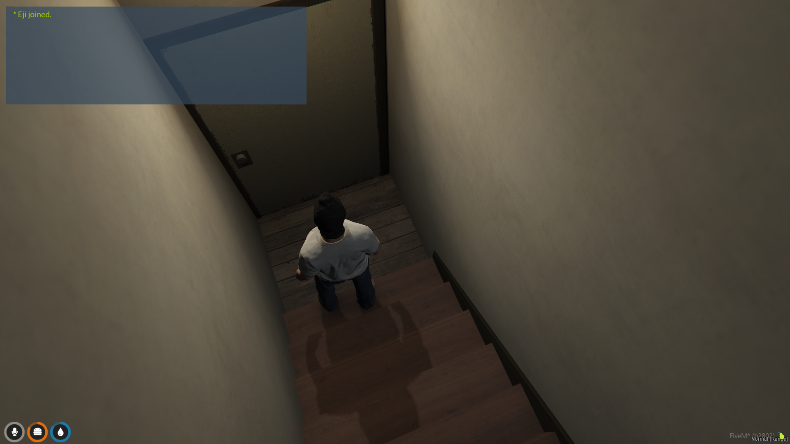
   after that, use `/vector4` command, and now paste the vector 4 coordinates to the config, let's also get the dog coords and the guard (human) coord.

   Now our config should look like this.

   ```lua
   Config.Tiers.IPL.GTAOHouseLow1 = {
    ipl = "GTAOHouseLow1",
    exit = vector4(266.13, -1007.35, -101.01, 1.68), -- <-- our exit coords
    guards = {
        dog = {
            coords = vector4(265.93, -1002.76, -99.01, 181.32),
            model = "dog_model",
            anim = {
                animdict = "animdict",
                animation = "animname",
            },
        },
        human = {
            [1] = {
                model = "model",
                anim = {
                    animdict = "animdict",
                    animation = "animname",
                },
                coords = vector4(260.52, -996.69, -99.01, 98.37),
                netid = nil,
            },
        },
    },
    loot = {},
   }
   ```

3. Set the model and animation

   #### You can find the model/peds list [here](https://forge.plebmasters.de/peds)

   I want to use [U_M_Y_SmugMech_01](https://forge.plebmasters.de/peds/MTEyNTQ5MDI4NA) as the guard model and [A_C_Rottweiler](https://forge.plebmasters.de/peds/Mjg3NjMxMDI0Mw) as the dog model

   #### To find the animation you can search it [here](https://forge.plebmasters.de/animations)

   I want to use [amb@code_human_in_bus_passenger_idles@female@sit@idle_a : idle_a](https://forge.plebmasters.de/animations/amb@code_human_in_bus_passenger_idles@female@sit@idle_a@idle_a) as my guard animation and I want to use [creatures@rottweiler@amb@world_dog_barking@idle_a : idle_a](https://forge.plebmasters.de/animations/creatures@rottweiler@amb@world_dog_barking@idle_a@idle_a) as my dog animation

   now our config should look like this

   ```lua
   Config.Tiers.IPL.GTAOHouseLow1 = {
    ipl = "GTAOHouseLow1",
    exit = vector4(266.13, -1007.35, -101.01, 1.68),
    guards = {
        dog = {
            coords = vector4(265.93, -1002.76, -99.01, 181.32), -- dog coords
            model = "A_C_Rottweiler", -- dog model
            anim = {
                animdict = "creatures@rottweiler@amb@world_dog_barking@idle_a", -- dog animdict
                animation = "idle_a", -- dog animation name
            },
        },
        human = {
            [1] = {
                model = "U_M_Y_SmugMech_01", -- guard model
                anim = {
                    animdict = "amb@code_human_in_bus_passenger_idles@female@sit@idle_a", -- guard animdict
                    animation = "idle_a", -- guard animation name
                },
                coords = vector4(260.52, -996.69, -99.01, 98.37), --guard coords
                netid = nil,
            },
        },
    },
    loot = {},
   }
   ```

4. Setting up lootable items.

   We need dev script to make our job easier, I recommend use [dolu_tool](https://github.com/dolutattoo/dolu_tool)

   We can either spawn new item or we can use the item that are already inside the ipl

   #### NOTE: the item that already inside the ipl, must be removeable using delete entity, or it will not work

   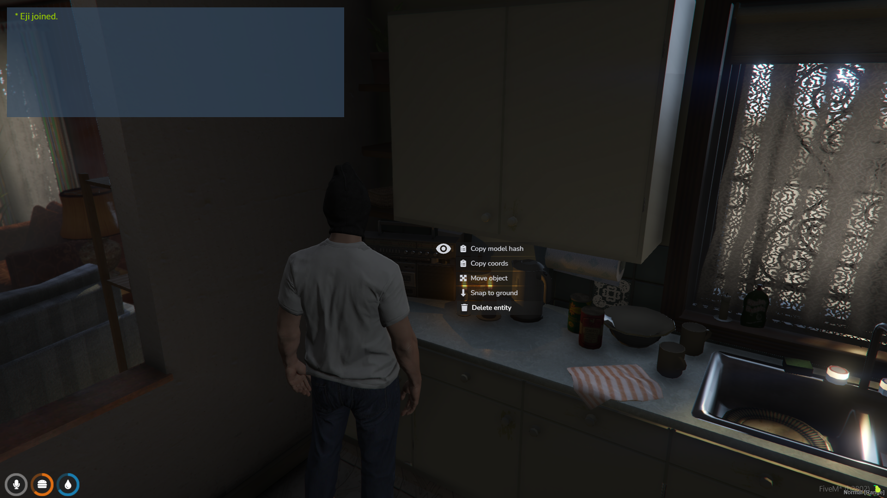

   - Using item from ipl

     Use alt key and select `copy model hash` after that go to [gta-objects.xyz](https://gta-objects.xyz/objects) and paste the hash to search bar
     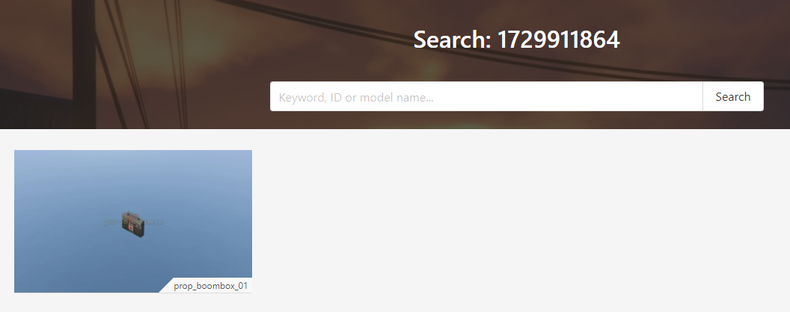
     now that we have our model name, we can put it inside loots.

     To get the coords we can use target eye and choose `copy coords`

     ```
     - isobject: `boolean`
        - data: `table`
        - name: `string` prop/object name
        - coords: `vector3` prop coords
        - label: `string` third eye label
        - icon: `string` font awesome icon for target
        - itemnname: `string` item name that we will get after interact with the props
     ```

     ```lua
        loots = {
            [1] = {
                isobject = true,
                data = {
                    name = "prop_boombox_01",
                    coords = vector3(263.35543823242, -994.68505859375, -98.803260803223),
                    label = "Take Boombox",
                    icon = "fas fa-headphones",
                    itemname = "boombox"
                }
            }
        }
     ```

   - Spawn item for ipl

     We can use dolu_tools to get our coords, rotation for spawning the item
     Press `F3` to open dolu menu, go to object spawner
     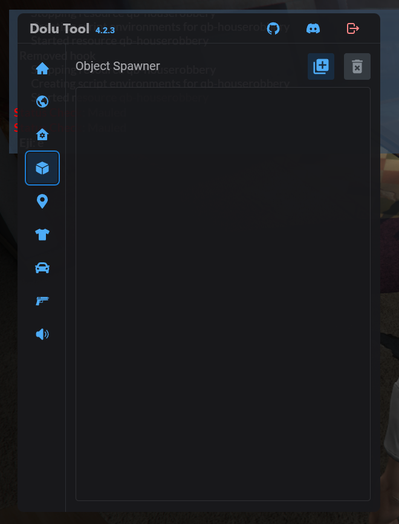

     Click the `+` icon and type what props/object you want to spawn you can use [gta-objects.xyz](https://gta-objects.xyz/objects) to find the object, let say we want to add safe
     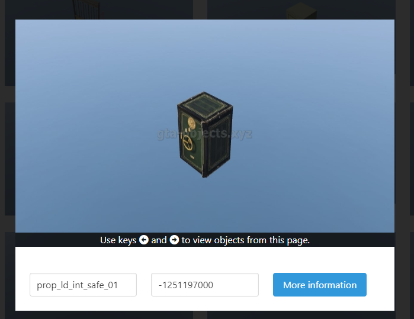

     We can copy the props model name and paste it to dolu menu and press confirm
     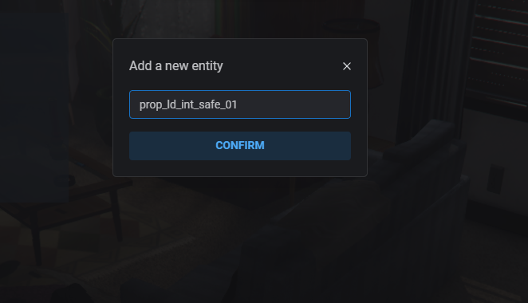

     After that you can move around the props and rotate it wherever you like
     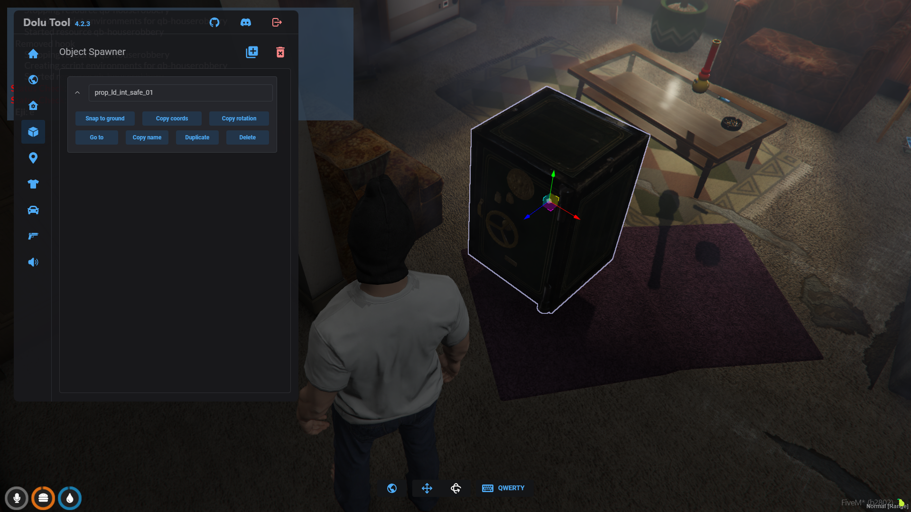

     After you satisfy with all the position and rotation, you can copy coords, rotation and paste it like below

     ```lua
     loots = {
        ...,
        [2] = {
            isobject = true,
            isopen = false, -- this one is only if the props is not single loot (stash)
            minigame = "drill", -- you can see all the minigame type on `shared/hack.lua` line 49
            -- REMEMBER! only put this one if the props is not single loot
            items = {
                type = "safe",
            },
            data = {
                name = "prop_ld_int_safe_01", -- our prop name
                coords = vec3(258.6966857910156, -999.2167358398438, -99.53580474853516),
                rotation = vec3(0, 0, 97.7616958618164),
                label = "Crack Safe", -- target label when it's locked
                openlabel = "Open Safe", -- target label when it's unlocked
                icon = "fas fa-lock", -- target icon when locked
                openicon = "fas fa-unlock", -- target icon when unlocked
                forceOnGround = true, -- to make it on ground properly
                -- itemname = "item_name" -- ONLY UNCOMMENT THIS ONE WHEN IT'S SINGLELOOT
            }
        }
     }

     ```

5. Setting up lootable zones

   Use `zone` command from ox lib, type box as the zone type, move, resize the zone as you like, for example, I put it on the kitchen cabinet
   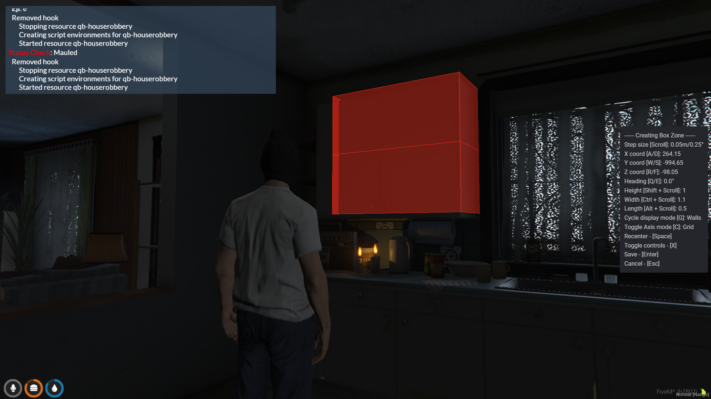

   Press enter and put whatever name you want and press enter
   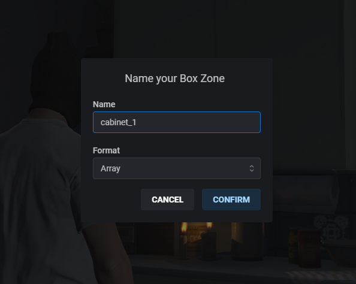

   You can find your created zones at `ox_lib/created_zones.lua`

   now we can put our data inside the loot table

   ```lua
   loots = {
        ...,
        [3] = {
            isobject = false,
            minigame = "lockpick", -- this one is optional, if there is no minigame, it mean the stash will be unlocked
            isopen = false,
            -- only use below if it's not a singleloot
            items = {
                type = "kitchen", -- you can see the item type in server/functions/LootHandle.lua line 24
            },
            data = {
                -- paste created zone data below
                name = "cabinet_1",
                coords = vec3(264.15, -994.65, -98.05),
                size = vec3(1.1, 0.5, 1),
                rotation = 0.0,
                ---
                label = "Lockpick Cabinet",
                openlabel = "Open Cabinet",
                icon = "fas fa-lock",
                openicon = "fas fa-hand",
                -- itemname = "item_name", -- only uncomment this if it's singleloot
            }
        }
   }
   ```

   Our full config should look like this (I add more loots)

```lua
Config.Tiers.IPL.GTAOHouseLow1 = {
    ipl = "GTAOHouseLow1",
    exit = vector4(266.13, -1007.35, -101.01, 1.68),
    guards = {
        dog = {
            coords = vector4(265.93, -1002.76, -99.01, 181.32),                 -- dog coords
            model = "A_C_Rottweiler",                                           -- dog model
            anim = {
                animdict = "creatures@rottweiler@amb@world_dog_barking@idle_a", -- dog animdict
                animation = "idle_a",                                           -- dog animation name
            },
        },
        human = {
            [1] = {
                model = "U_M_Y_SmugMech_01", -- guard model
                anim = {
                    animdict = "anim@amb@nightclub@lazlow@lo_sofa@",
                    animation = "lowsofa_dlg_notagain_laz",             -- guard animation name
                },
                coords = vector4(262.67, -1004.3, -98.27 - 1.0, 169.9), --guard coords
                netid = nil,
            },
        },
    },
    loot = {
        [1] = {
            isobject = true,
            data = {
                name = "prop_boombox_01",
                coords = vector3(263.35543823242, -994.68505859375, -98.803260803223),
                label = "Take Boombox",
                icon = "fas fa-headphones",
                itemname = "boombox"
            }
        },
        [2] = {
            isobject = true,
            isopen = false,    -- this one is only if the props is not single loot (stash)
            minigame = "drill", -- you can see all the minigame type on `shared/hack.lua` line 49
            -- REMEMBER! only put this one if the props is not single loot
            items = {
                type = "safe",
            },
            data = {
                name = "prop_ld_int_safe_01", -- our prop name
                coords = vec3(258.6966857910156, -999.2167358398438, -99.53580474853516),
                rotation = vec3(0, 0, 97.7616958618164),
                label = "Crack Safe",       -- target label when it's locked
                openlabel = "Open Safe",    -- target label when it's unlocked
                icon = "fas fa-lock",       -- target icon when locked
                openicon = "fas fa-unlock", -- target icon when unlocked
                forceOnGround = true,       -- to make it on ground properly
            }
        },
        [3] = {
            isobject = false,
            minigame = "lockpick", -- this one is optional, if there is no minigame, it mean the stash will be unlocked
            isopen = false,
            -- only use below if it's not a singleloot
            items = {
                type = "kitchen", -- you can see the item type in server/functions/LootHandle.lua line 24
            },
            data = {
                -- paste created zone data below
                name = "cabinet_1",
                coords = vec3(264.15, -994.65, -98.05),
                size = vec3(1.1, 0.5, 1),
                rotation = 0.0,
                ---
                label = "Lockpick Cabinet",
                openlabel = "Open Cabinet"
            },
        },
        [4] = {
            isobject = false,
            isopen = false,
            items = {
                type = "fridge"
            },
            data = {
                name = "fridge_1",
                coords = vec3(266.1, -997.6, -99.05),
                size = vec3(0.35, 0.8, 1.85),
                rotation = 0.0,
                label = "Search Fridge",
                openlabel = "Open Fridge",
                icon = "fas fa-utensils",
                openicon = "fas fa-utensils",
            }
        }
    },
}

```

Let's test our configs

[Video](https://youtu.be/mfvZ-LS3cmc)

### Adding new shells

<b>Make sure debug mode is enabled on config otherwise the command will not work</b>

1. Create new files inside `shared/shell` folder

   Here is the snippet for it.

   ```lua
   Config.Tiers.Shell.name = {
        exit = vec4(),
        shell = "shell_name",
        guards = {
            dog = {
                coords = vector4(),
                model = "model_name",
                anim = {
                    animdict = "animdict",
                    animation = "anim",
                },
            },
            human = {
                [1] = {
                    model = "model_name",
                    anim = {
                        animdict = "animdict",
                        animation = "anim",
                    },
                    coords = vector4(),
                    netid = nil,
                }
            }
        },
        furnitures = {},
        loot = {}
    }

   ```

   Find your shell name, for example, I'm gonna use [free shell](https://www.k4mb1maps.com/package/5015840) from K4mb1

   Use `test_shell shell` command example `test_shell shell_v16low` it will teleport you to the shell.

2. Getting offsets coords.

   To get the offsets coords, you can do `vector4` or `vector3` command and after you got the x y and z, you can do.
   `/getoffset x y z w?`
   for example:

   `/getoffset 1174.73, -1336.5, 65.82, 3.87`

   it will copy the new vec3 or vec4 coords

   `4.6300048828125, -6.239990234375, -4.6519546508789, 3.87`.
   you can paste it on the exit zone

   ## Note that the coords may not be correct especially the height, so you need to tweak the coords when you testing the config

   ```lua
   Config.Tiers.Shell.v16low = {
        exit = vec4(4.6300048828125, -6.239990234375, -4.6519546508789, 3.87),
        ...
   }
   ```

3. Placing furnitures.

   > All the model name for the props you can see `Spawn item for ipl` section

   You can use dolu tools to place furniture when you still inside the shell (/test_shell)

   For example I want to place this couch here
   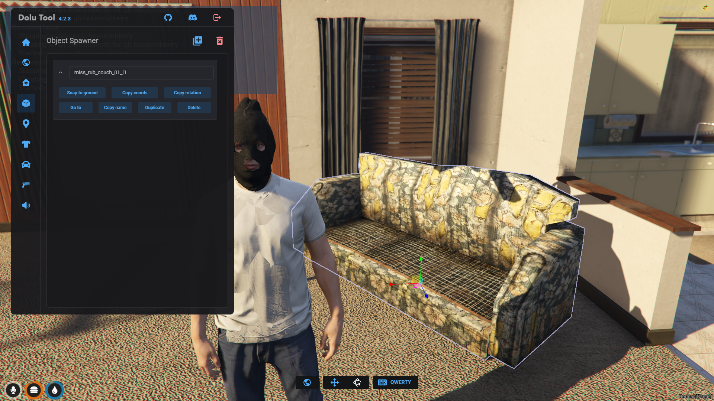

   Now we can copy the coords, and rotation.

   For the coords, we need the offset coords, not the original one. so we still need to do the `getoffset` command

   `/getoffset 1170.0819091796875, -1325.425537109375, 66.77865600585938`

   now we can put it in our furnitures table

   ```lua
    ...,
    furnitures = {
        [1] = {
            hashname = "miss_rub_couch_01",
            rotation = {x = 0, y= 0, z= -69.29768371582031},
            position = vec3(-0.01806640625, 4.83447265625, -3.6932983398438),
            forceOnGround = true
        }
    },
   ```

   you can add as much as you wish.

4. Placing lootable items.

   Let say we want to add a tube tv that can be lootable.

   First we need to spawn the props using dolu tool
   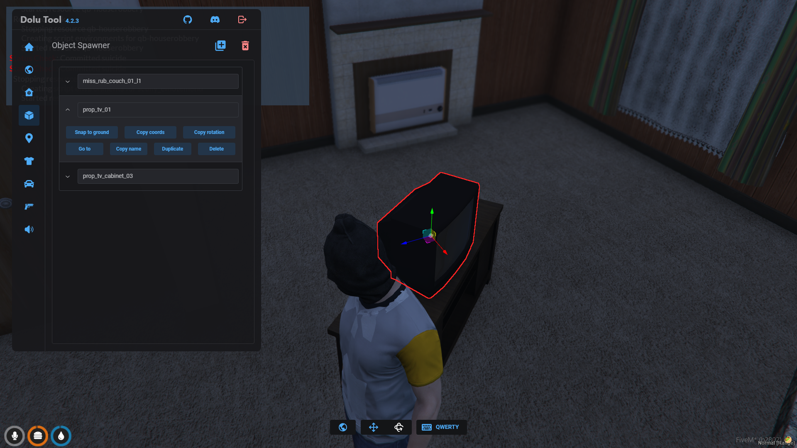

   Copy the coords, and use `getoffset` command, and also copy the rotation and paste it inside loot table

   ```lua
   ...,
   furnitures = {...},
   loot = {
    [1] = {
        isobject = true,
        name = "prop_tv_01",
        data = {
            coords = vec3(-2.2469482421875, 2.8480224609375, -2.7299575805664),
            rotation = {
                x = 0, y = 0, z = 123.459
            },
            label = "Take TV",
            icon = "fas fa-tv",
            itemname = "tube_tv",
            islooted = false,
            forceOnGround = true,
        }
    }
   }
   ```

   Now, let's add lootable cabinet, I want to spawn this cabinet here `prop_rub_cabinet01`
   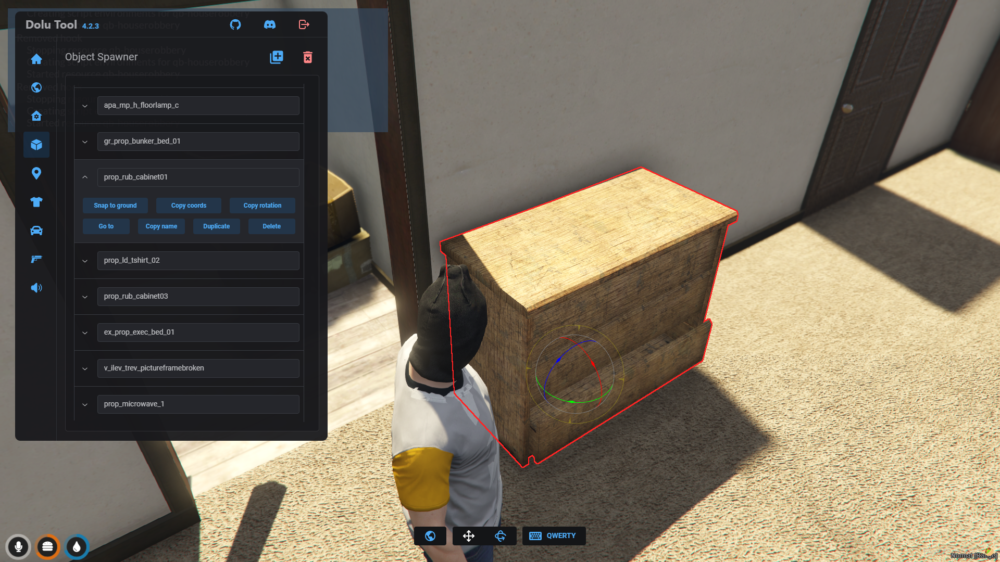
   Copy the spawn name, to make it lootable like stash, we can do

   ```lua
   loot = {
    ...,
    [2] = {
        minigame = "lockpick", -- if this is commented out, that mean the cabinet will be unlocked
        isopen = false,
        isobject = true,
        name = "prop_rub_cabinet01",
        data = {
            coords = vec3(2.197509765625, -0.1278076171875, -3.6562576293945), -- the coords we get from `getoffset` command
            rotation = {
                x = 0, y = 0, z= -180.0
            }, -- the rotation that we copied from dolu tool
            forceOnGround = true,
            label = "Lockpick cabinet", -- label when it's locked
            openlabel = "Open Cabinet",
        },
        items = {
            type = "general", -- item type, you can see server/functions/LootHandle.lua line 24
        }
    }
   }
   ```

5. Adding lootable zones to shell

   Use `zone` creator command from ox_lib, make sure you're inside the test shell
   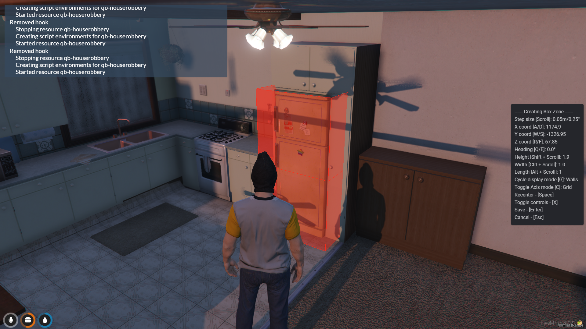

   I want to make the fridge lootable, so I put the zone here. After you satisfy with the position, you can press enter and name the zone whatever you like, and press enter
   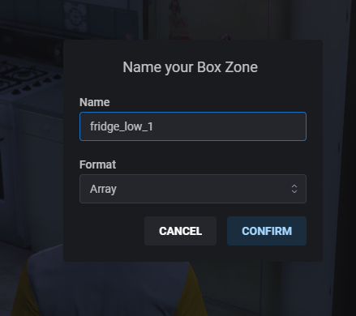

   After that, go to `ox_lib/created_zones.lua` and find your created zones, remember we still need to convert the coords first, using `getoffset` command

   `/getoffset 1174.9, -1326.95, 67.85`

   result:
   `4.800048828125, 3.31005859375, -2.621955871582`

   Let's add the zone data to our loot table

   **NOTE:** Please look at the `known issue`, number one

   ```lua
   loot = {
    ...,
    [4] = {
        -- minigame = "lockpick", if we comment out this one, the stash will be opened (without any minigame required)
        items = {
            type = "fridge"
        }, -- if it's singleloot, you can comment this one, NOTE: Make sure you only choose one, you can't choose both items and itemname at the same time
        data = {
            name = "fridge_low_1",
            coords = vec3(-4.800048828125, -3.31005859375, -0.621955871582), -- Zones from offset (I've changed it a little bit because of the known issue)
            size = vec3(1.0, 1, 1.9),
            rotation = 0.0,
            label = "Open Fridge",
            openlabel = "Open Fridge",
            icon = "fas fa-hand",
            openicon = "fas fa-hand",
        }
    }
   }
   ```

   Allright, we have configured all of our furnitures and lootable, let's test it first

   [Video](https://youtu.be/2QWOSHlkz20)

6. Setting up guards for shell.

   Make sure you still inside the test shell.

   - Configuring dog

   ```lua
   ...,
   guards = {
    dog = {}
   }
   ```

   Stand where you want the dog to be there, do `/vector4` command, and after you got the output, example: vector4(1174.72, -1331.94, 67.82, 180.08), you need to convert it using `getoffset` command

   example: `/getoffset 1174.72, -1331.94, 67.82, 180.08`

   output: `4.6199951171875, -1.679931640625, -2.6519546508789, 180.08`

   and we can paste it in our config

   > Remember to configure the height

   ```lua
   ...,
   guards = {
    dog = {
        coords = vec4(4.6199951171875, -1.679931640625, -2.6519546508789, 180.08),
        model = "a_c_rottweiler",
        anim = {
            animdict = "creatures@rottweiler@amb@world_dog_barking@idle_a",
            animation = "idle_a",
        },
    }
   }
   ```

   - Configuring guard (human)

     Stand where you want the guard to be there, do `/vector4` command, and after you got the output, example: vector4(1169.11, -1325.32, 67.82, 109.35), you need to convert it using `getoffset` command

     example: `/getoffset 1169.11, -1325.32, 67.82, 109.35`

     output: `-0.989990234375, 4.9400634765625, -2.6519546508789, 109.35`

     > Remember to configure the height (z)

   ```lua
   ...,
   guards = {
    ...,
    human = {
        [1] = {
            model = "g_m_y_ballaorig_01",
            anim = {
                animdict = "timetable@ron@ron_ig_2_alt1",
                animation = "ig_2_alt1_base",
            },
            coords = vec4(-0.989990234375, 4.9400634765625, -0.6519546508789, 109.35),
        }
    }
   }
   ```

### Setting up new item

Go to `shared/hack.lua` you will see `local items =` table

```lua
local items = {
    ...,
    ["itemname"] = {
        initialanim = {
            scully = "hammer" -- emote name (by command) example: /e hammer
            -- YOU CAN ONLY CHOOSE ONE (scull or animdict), uncomment below to use animdict
            --animdict = "animdict",
            --anim = "animation"
        },
        probability = 0.8, -- chance to notify the police
        minigame = {
            type = "circle", -- minigame name
            param = {
                15, 25 -- minigame parameter
            }
        }
    },
}
```

### Adding new minigame

To add more minigame, you can go to `shared/hack.lua` in `minigame` function, you can add your own minigame type after all other minigame.

Example:

```lua
    elseif type == "safe" then
        local rand = math.random(0,99)
        return exports["pd-safe"]:createSafe({rand})
    -- YOUR MINIGAME
    elseif type == "your-minigame"
        local success = exports["minigame-resource"]:Minigame()
        res:resolve(success)
    end
```

After that go to `client/functions/Minigame.lua` in `StartMinigame` function and call your minigame there, above `if iteminfo.afteranim and success then`

Example:

```lua
...
elseif minigametype == "safe" then
	success = MiniGame("safe")
elseif minigametype == "your-minigame" then
    success = Minigame("your-minigame")
end
```

### Known Issue

1. Offsets Coords

Sometimes the offsets coords is not right, you can play with the x, y, and z, for example, this one below is not right, (reversed) so you can play with reversing the value, from positive to negative, for the z (height)

`vec3(4.800048828125, 3.31005859375, -2.621955871582)`

to
`vec3(-4.800048828125, -3.31005859375, 2.621955871582)`
